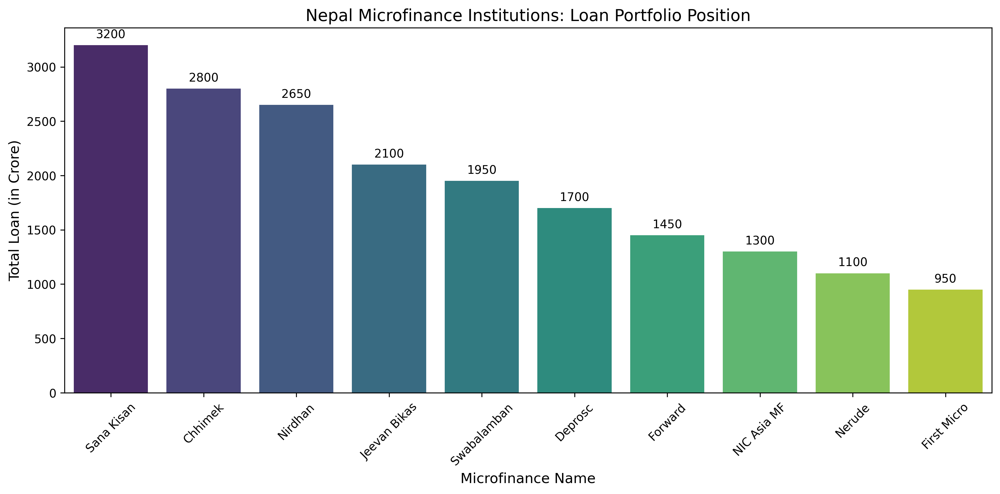
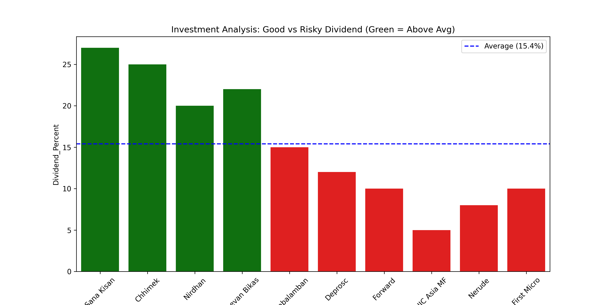
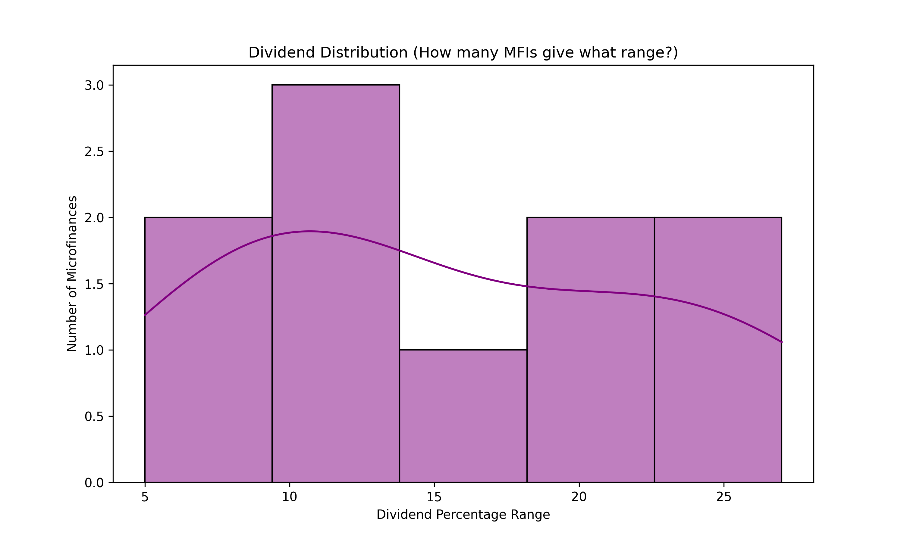

# nepal-microfinance-analysis
A data analysis and visualization project of top 10 Microfinance Institutions in Nepal using Python, Pandas, and Seaborn.
# 📈 Nepal Microfinance Investment & Data Analysis

## 📌 Project Overview
This project is a comprehensive data-driven analysis of the top 10 Microfinance Institutions (MFIs) in Nepal. Using Python's powerful data science libraries, I have analyzed and visualized the market dominance, profitability, and investment potential of these institutions to help investors make informed decisions.

## 🚀 Key Features
- **Market Leadership Analysis:** Visualized the total loan portfolio to identify market leaders.
- **Investment Ranking:** Categorized MFIs into "First, Second, and Third" positions based on Dividend Payouts.
- **Risk & Reward Distribution:** Used Histograms to understand the industry-wide dividend trends.
- **Performance Tracking:** Automated sorting of financial data for quick business insights.

## 🛠️ Tools & Technologies
- **Language:** Python
- **Libraries:** Pandas (Data Manipulation), Matplotlib & Seaborn (Data Visualization)
- **Editor:** VS Code
- **Methodology:** Descriptive Statistical Analysis

## 📊 Visualizations & Insights

### 1. Market Position by Loan Portfolio
This chart identifies which microfinance has the largest reach in Nepal. Larger bars indicate higher market share and stability.


### 2. Top 3 Investment Choices (Dividend Basis)
A specialized ranking of the top 3 MFIs. This is designed for investors looking for the highest annual returns.


### 3. Dividend Distribution (Risk Analysis)
A Histogram showing how many MFIs fall into specific dividend ranges, helping to understand the sector's overall health.


## ⚙️ How to Setup and Run
1. Clone this repository to your local machine.
2. Ensure Python is installed.
3. Install the required libraries:
   ```bash
   pip install pandas matplotlib seaborn
